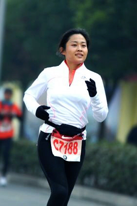
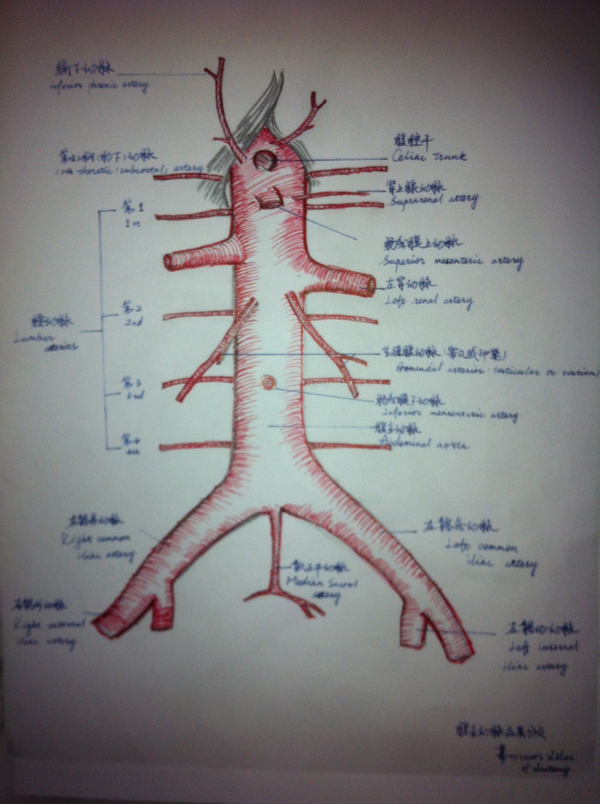

### I am a biostatistics student learning data science in R !

I am Tricia Zhai. Born and raised in China. Now studying in Columbia University Mailman School of Public Health, in NYC. 
Life is beautiful and I wish everybody have a health and happy life.
I was in medicine, trying to help people and found out still too much is unknow. Now I study biostatistics, wish I can contribute my efforts to medical research in the future. I believe science and technology can make the world healthier and happier. Trying my best to learn as much as I can !

## I add code


### Links:
[Email](cz2544@cumc.columbia.edu)

[Github](https://github.com/TriciaZhai)

[Linkin](https://www.linkedin.com/in/chunxiao-zhai-71b655131/)

[Resume](resume.pdf)

## Me as a human
as a kid:\


as a runner:\



## What I did before
My note:\



My rat femoral AV fistula: \


## What I do now
```{r}
library(tidyverse)

weekdays = head(weekdays(.leap.seconds), 7) %>% 

today = Sys.Date()
week = c(3:9) + today
day = factor( weekdays(week), levels = c("Monday", "Tuesday", "Wednesday", "Thursday", "Friday", "Saturday", "Sunday"))


for(as.numeric(day) in 1:7){
  to_do()
}
  
to_do = function(x){
  if (as.numeric(x) < 5) {
    stop("Go to classes, do homework, gym, sleep")
  } else if (as.numeric(x) == 5) {
    stop("do homework, gym, food shopping, sleep")
  }
    stop("go out play, cook, sleep")
}


vec_1 = c("do homework", "gym", "food shopping", "sleep")
vec_2 = c(rbinom(4,1, 0.6))
vec_1*vec_2
```


