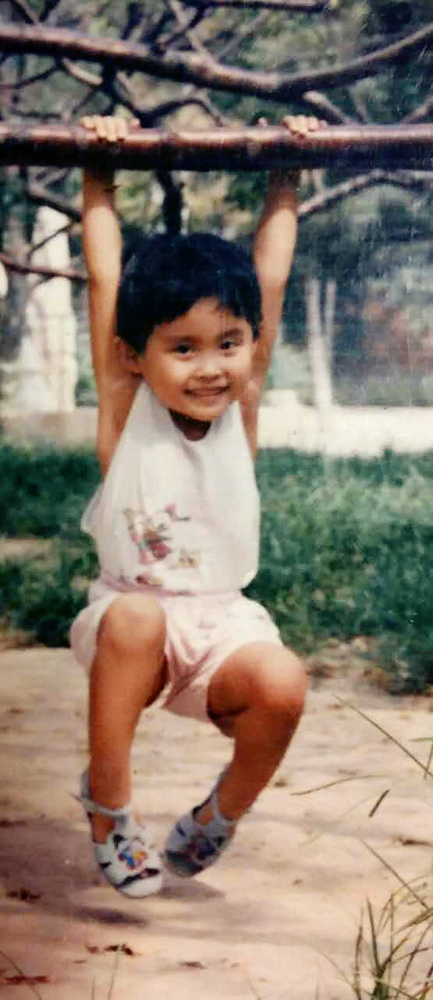

### I am a biostatistics student learning data science in R !

I am Tricia Zhai. Born and raised in China. Now studying in Columbia University Mailman School of Public Health, in NYC. 
Life is beautiful and I wish everybody have a health and happy life.
I was in medicine, trying to help people and found out still too much is unknow. Now I study biostatistics, wish I can contribute my efforts to medical research in the future. I believe science and technology can make the world healthier and happier. Trying my best to learn as much as I can !

## I add code


### Links:
[Email](cz2544@cumc.columbia.edu)

[Github](https://github.com/TriciaZhai)

[Linkin](https://www.linkedin.com/in/chunxiao-zhai-71b655131/)

[Resume](resume.pdf)

## Me as a human
as a kid:\



as a runner:\


## What I did before
My note:\


My rat femoral AV fistula: \


## What I do now
```{r}
library(tidyverse)
today = Sys.Date()
week = c(0:6) + today
to_do = function(x)
  {
  if (weekdays(x) == "Monday") 
    {
    paste("Go to classes, do homework, gym, sleep")
  } 
  else if (weekdays(x) == "Tuesday") {
      paste("Go to classes, food shopping, do homework, sleep")
  }
  else if (weekdays(x) == "Wedsday") {
      paste("Go to classes, do homework, gym, sleep")
  }
  else if (weekdays(x) == "Thursday") {
      paste("Go to classes, watch kids in PS128, Go to class, sleep")
      }
  else if (weekdays(x) == "Friday") {
      paste("do homework, gym, sleep")
      }
    paste("go out, cook, sleep")
}

tibble(week, to_do(week))
knitr::kable(week, to_do(week)) 
```


